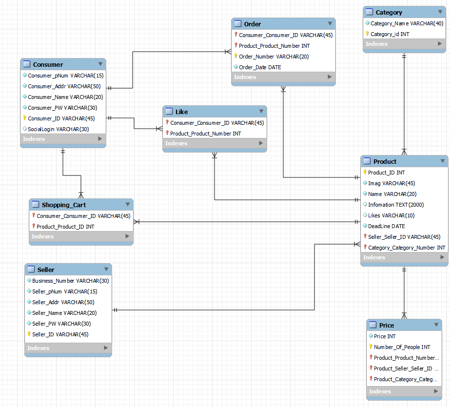

<h1 align="center">학생들에게 보여주기 위한 프로젝트 👍</h1>


<div align="center">
  
</div>


> [플레이 데이터] 한화시스템 BEYOND SW캠프 / 강사팀


🎬[Demo 시연영상](https://www.youtube.com/watch?v=dhMrKTwNI8U&lc=UgzCJR3WxkvsckRyyO94AaABAg&ab_channel=%EB%94%B0%EB%9D%BC%ED%95%98%EB%A9%B4%EC%84%9C%EB%B0%B0%EC%9A%B0%EB%8A%94IT)   
📃[프로젝트 회고록](블로그주소)

----------

## ✨ 프로젝트 설명

```sh
학생들에게 보여주기위한 프로젝트이라서 이런 저런 서비스 다 있음
```

----------

## 📌 프로젝트 목표

```sh
Centos 8, Mysql(InnoDB)를 이용하여 설계를 통한 ERD 작성 및 구현
대용량 트래픽을 고려한 서버 이중화
```

----------

## 🐧 프로젝트 구현

> 🏢 ERD

<div align="center">
  
</div>

----------

> 💻 Keepalived를 활용한 Ative-Standby 서버 이중화
- 마스터에 쓰기 작업시 슬레이브로 자동 복사
<div align="center">
  
</div>

- 마스터에 장애 발생시 자동으로 Standby 서버가 활성화
<div align="center">
  
</div>

----------

## 🤼‍♂️팀원

Team Leader : 🐯**홍길동**

Backend : 🐶 **김철수**

Backend : 🐺 **박철수**

Frontend : 🐱 **이철수**

인공지능 : 🦁 **최철수**
