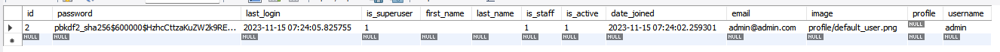
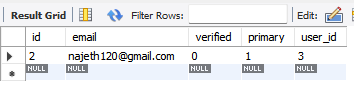
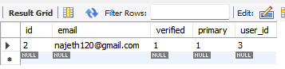
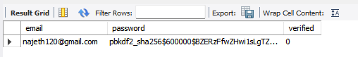
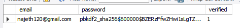

<h1 align="center">학생들에게 보여주기 위한 프로젝트 👍</h1>


<div align="center">
  
</div>


> [플레이 데이터] 한화시스템 BEYOND SW캠프 / 강사팀


🎬[Demo 시연영상](https://www.youtube.com/watch?v=dhMrKTwNI8U&lc=UgzCJR3WxkvsckRyyO94AaABAg&ab_channel=%EB%94%B0%EB%9D%BC%ED%95%98%EB%A9%B4%EC%84%9C%EB%B0%B0%EC%9A%B0%EB%8A%94IT)   
📃[프로젝트 회고록](블로그주소)

<br>

## ✨ 프로젝트 설명

```sh
학생들에게 보여주기위한 프로젝트이라서 이런 저런 서비스 다 있음
```

## 📌 프로젝트 목표

```sh
Centos 8, Mysql(InnoDB)를 이용하여 개념 -> 논리 -> 물리 설계를 거친 DB를 구축
```


## 🔍 Overview

### 1. 회원 기능
##### 1-1. 회원가입

```sh
INSERT INTO users_user (password, email, profile, username) VALUE('~~','~~','~~','~~');
```

전
<div align="center">
    
</div>
후
<div align="center">
    
</div>

##### 1-2 이메일 인증

```sh
UPDATE account_emailaddress SET verified=1 WHERE id=3;
```

전
<div align="center">
    
</div>
후
<div align="center">
    
</div>

##### 1-3. 로그인

```sh
SELECT users_user.email, users_user.password, account_emailaddress.verified 
FROM users_user 
LEFT OUTER JOIN account_emailaddress ON users_user.email = account_emailaddress.email  
WHERE users_user.email='메일주소';
```
인증 전 로그인
<div align="center">
    
</div>

인증 후 로그인
<div align="center">
    
</div>

<br>

### 2. 게시판 기능

<div align="center">
    
</div>
어떤 어떤 어떤 걸 작성하는 게시판 기능

<br>


## System Architecture

<div align="center">
    
</div>
대용량 트래픽을 고려한 서버 이중화

<br>


## 🤼‍♂️팀원

Team Leader : 🐯**홍길동**

Backend : 🐶 **김철수**

Backend : 🐺 **박철수**

Frontend : 🐱 **이철수**

인공지능 : 🦁 **최철수**
